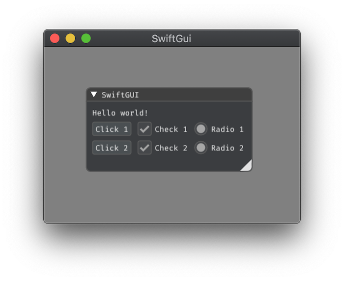
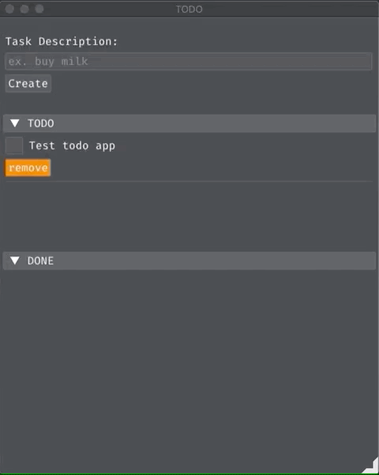
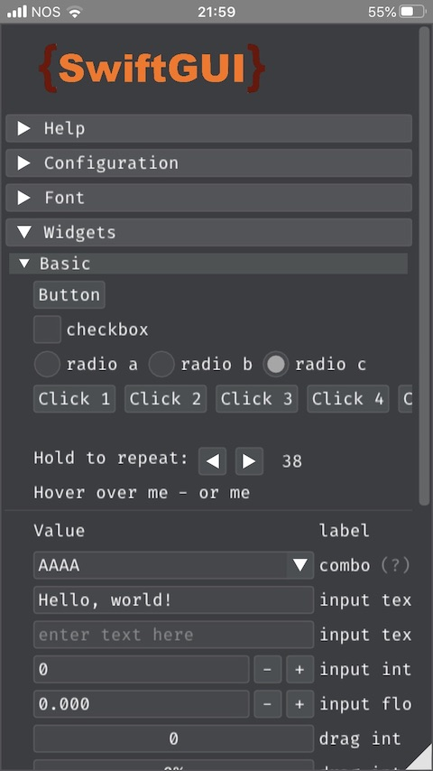

<center>


[](LICENSE)
[](https://swift.org/download)
[](https://github.com/Carthage/Carthage)

<b>SwiftGUI</b> is an experimental API inspired by <b>SwiftUI</b> DSL, using Dear ImGui as renderer and running on OSX and iOS.
</center>

<p align="center">
    
</p>

```swift
Window("SwiftGUI") {

    Text("Hello world!")

    HStack {
        ForEach(1...2) { val in
            Button("Click \(val)")
        }

        ForEach(1...2) { val in
            CheckBox("Check \(val)", selectedState: true)
        }

        ForEach(1...2) { val in
            RadioButton("Radio \(val)", activeState: true)
        }
    }
}
```

## Highlights

* Easy to use abstraction for Dear ImGui
* Multi-platform support (iOS 11+ and macOS 10.13+)
* Huge list of UI components already available

### Theme support
    - Color scheme (embedded Darcula and Light)
    - Custom Fonts (embedded FiraCode)

### Widgets
    - Buttons
    - CheckBox
    - Color Selection
    - ComboBox
    - Drag
    - Dock
    - Image
    - InputFields
    - Lists
    - Menu
    - Plotting
    - Popup
    - RadioButton
    - SelectableFields
    - Sliders
    - TabBar
    - Texts
    - Text Editor (Code editor)
    - Tooltips
    - Tree
    - Window
    - General 
        - Group
        - HStack
        - Separator/NewLine/Spacing/Indent
        - ForEach
        - Perform


## Installation

### Carthage

[Carthage](https://github.com/Carthage/Carthage) is intended to be the simplest way to add frameworks to your Cocoa application. Builds your dependencies and provides you with binary frameworks, but you retain full control over your project structure and setup. Carthage does not automatically modify your project files or your build settings.

To integrate `SwiftGUI` into your Xcode project using Carthage, specify it in your `Cartfile`:

```ogdl
github "erickjung/SwiftGUI" "0.7.0"
```

For `OSX` project, run:

```ogdl
carthage update --platform macOS
```

For `iOS` project, run:

```ogdl
carthage update --platform iOS
```

## Samples

### Sample01 (macOS)


### Sample 02 (macOS) - Simple TODO application



### Screenshot 01 (iOS)



## Contributing

Read the [Contributing guidelines](CONTRIBUTING.md)

## License

 [MIT](LICENSE)

## Using 

* [Dear ImGui](https://github.com/ocornut/imgui) (1.74)
* [cimgui](https://github.com/cimgui/cimgui)
* [ImGuiColorTextEdit](https://github.com/BalazsJako/ImGuiColorTextEdit)

