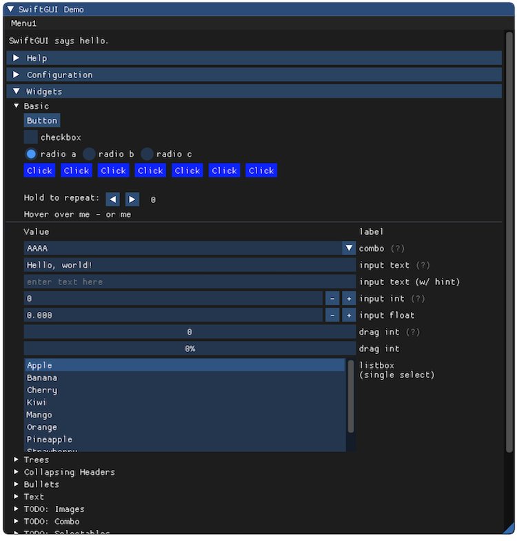
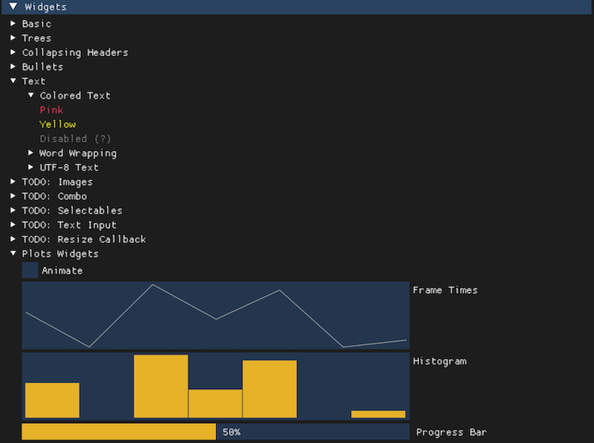
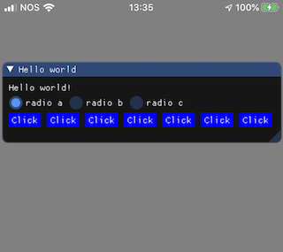

[](LICENSE)
[](https://swift.org/download)
[](https://github.com/Carthage/Carthage)

<b>SwiftGUI</b> is an experimental API inspired by <b>SwiftUI</b> declarative code, using Dear ImGui and running on OSX and iOS.


```swift
Window("Hello world") {

    Text("Hello world!")
    
    HStack {
        RadioButtonGroup(["radio a", 
                          "radio b", 
                          "radio c"],
                         selectedState: radioState) {
            radioState = $0
        }
    }
    
    HStack {
        ForEach((1...7)) { _ in
            Button("Click")
                .color(.button, color: .blue)
        }
    }
}
```

### Carthage

[Carthage](https://github.com/Carthage/Carthage) is intended to be the simplest way to add frameworks to your Cocoa application. Builds your dependencies and provides you with binary frameworks, but you retain full control over your project structure and setup. Carthage does not automatically modify your project files or your build settings.

To integrate `SwiftGUI` into your Xcode project using Carthage, specify it in your `Cartfile`:

```ogdl
github "erickjung/SwiftGUI" "0.1.0"
```

For `OSX` project, run:

```ogdl
carthage update --platform macOS
```

For `iOS` project, run:

```ogdl
carthage update --platform iOS
```

## Projects

* SwiftGUI-Core: Internal framework abstraction for cimgui
* SwiftGUI-PlatformiOS: Specific iOS renderer/handler code
* SwiftGUI-PlatformOSX: Specific OSX renderer/handler code
* SwiftGUI: The SwiftUI inspired API code
* Demos: Sample for OSX and iOS

## Demo

* Screenshot 01 (OSX)


* Screenshot 02 (OSX)


* Screenshot 01 (iOS)


## License

 * MIT

Uses [Dear ImGui](https://github.com/ocornut/imgui) and
[cimgui](https://github.com/cimgui/cimgui).

